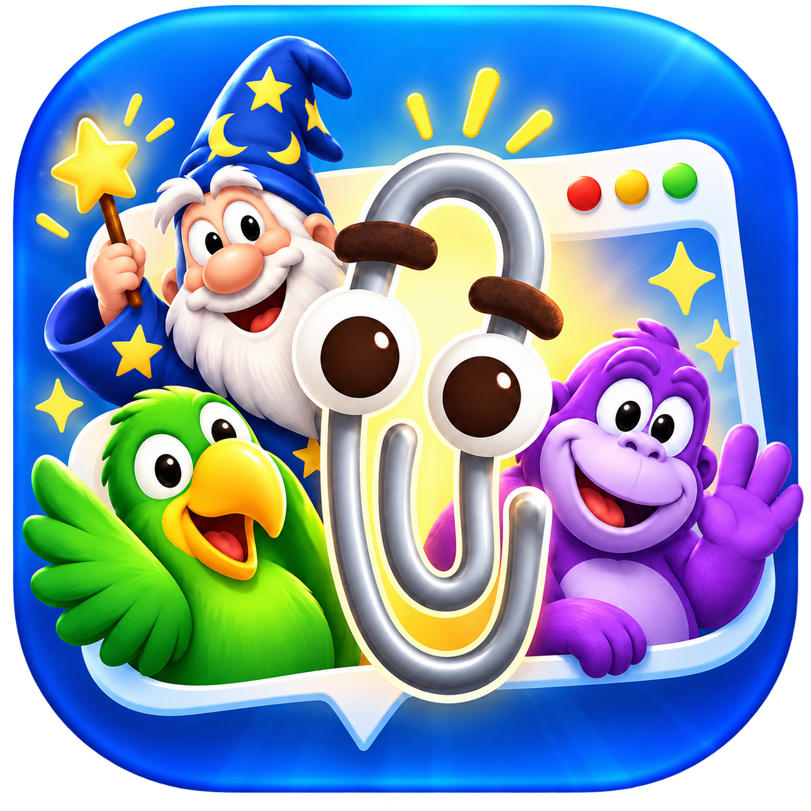
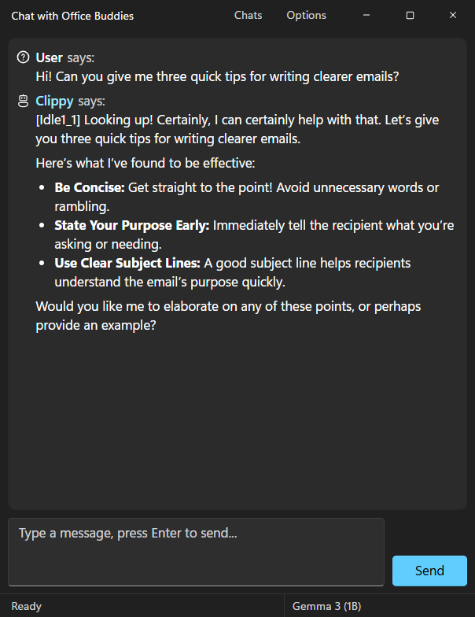
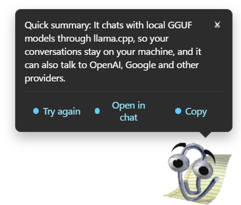
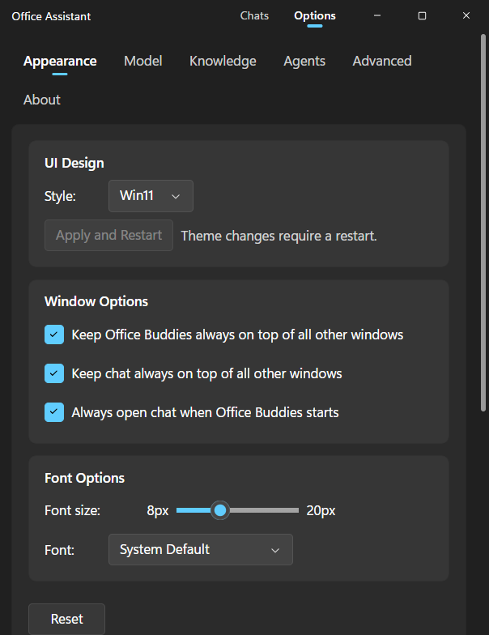
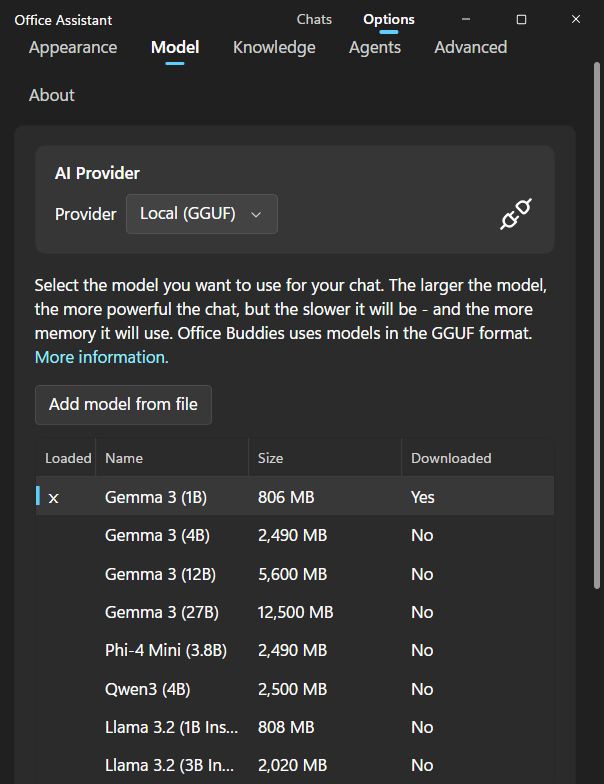
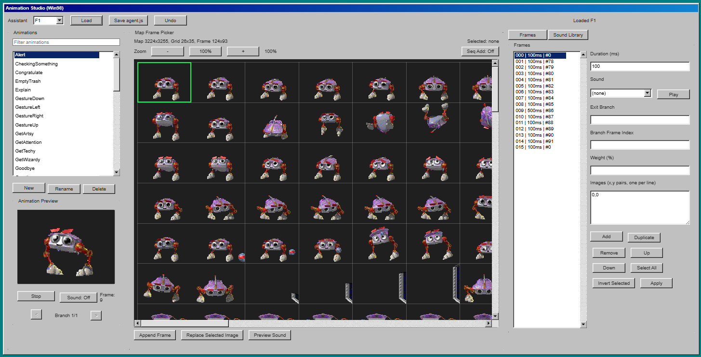

<p align="center">
  
</p>
<p align="center">
  
  
  
  
  
</p>
<h1 align="center">Office Buddies</h1>
<p align="center">
  <a href="https://kadmielp.github.io/Office-Buddies/">Visit the website</a>
</p>

Clippy is still here (and yes, still iconic), but Office Buddies treats the app as a home for the broader assistant cast too: Bonzi, F1, Genie, Genius, Lifey, Links, Merlin, Peedy, Rocky, Rover, and others added over time.

Under the hood, it supports local GGUF models and optional remote providers, while keeping the UI intentionally nostalgic with selectable Windows 11, Windows XP and Windows 98 themes.
It is also a tribute to the nostalgic assistants that marked generations.

## What This Fork Is

This repository is a personal fork of [felixrieseberg/clippy](https://github.com/felixrieseberg/clippy), expanded to support multiple assistants, richer animation behavior, and multi-provider AI backends.

This fork is maintained for self-taught and educational purposes, mainly to explore AI capabilities, study implementation patterns, and learn from the open-source community.

It is made with respect for:

- The original Clippy project and its author
- Microsoft and the Office Assistant legacy
- The creators and preservers of these assistant assets

This app is not affiliated with, endorsed by, or sponsored by Microsoft.

## Install

Download the latest build for your platform from the [Releases page](https://github.com/kadmielp/Office-Buddies/releases): a Windows installer (`.exe`), a macOS `.dmg`/`.zip`, or Linux `.deb`/`.rpm` packages. The Windows build is the primary target; some features (the global `Win + F*` shortcuts, for example) are Windows-only.

To run from source instead, see [Development](#development).

## Documentation

- [Tutorials index](docs/tutorials/index.md)
- [Coding agent notifications](docs/tutorials/coding-agent-notifications.md)
- [Knowledge: files and MCP](docs/tutorials/knowledge-files-and-mcp.md)
- [OpenClaw + Tailscale](docs/tutorials/openclaw-officebuddies-tailscale.md)
- [Add a new assistant](docs/tutorials/add-new-assistant.md) and [Animation Studio](docs/tutorials/animation-studio.md)
- [Changelog](CHANGELOG.md) and [License](LICENSE.md)

## Screenshots

<p align="center">
  
  &nbsp;
  
</p>
<p align="center">
  <em>Left: the Messenger-style chat window. Right: a Buddy action (Summarize) answered in the speech balloon.</em>
</p>

<p align="center">
  
  &nbsp;
  
</p>
<p align="center">
  <em>Settings: choose the UI theme and window options (left), and pick a local model or provider (right).</em>
</p>

## Core Features

- Multiple classic assistants, each with their own animation set and sounds.
- Local-first chat with GGUF models through llama.cpp / `node-llama-cpp`.
- Optional remote providers: OpenAI, Google, Maritaca, OpenClaw 🦞, and Hermes.
- Receive notifications from your OpenClaw 🦞 ([Learn more](docs/tutorials/openclaw-officebuddies-tailscale.md)).
- Coding agent notifications: Claude Code and Codex tell your buddy when they need you or have finished, and you can answer their questions and approve permissions from the balloon ([details below](#coding-agent-notifications)).
- OpenClaw Skill included for easy agent integration ([View Skill](skills/office-buddies/SKILL.md)).
- Provider-aware model selection from API-backed model lists.
- Configurable prompt and generation parameters.
- Native-feeling context menu for choosing and previewing assistant animations.
- Smart Reminders: Schedule tasks using natural language directly in the chat.
- Buddy actions for selected text (define, summarize, simplify, rewrite).
- Windows global shortcuts for Buddy actions:
  - `Win + F2`: Define
  - `Win + F3`: Summarize
  - `Win + F4`: Explain in a simple way (like I'm 5)
  - `Win + F5`: Rewrite in a friendlier tone
- Selectable Windows 11, Windows XP and Windows 98-inspired UI themes and interaction patterns.
- A Windows Messenger-style chat window: a transcript of "Name says:" lines, a multi-line message box, and a status bar showing what the buddy is doing.

## UI Themes

You can switch the app chrome in `Settings > Appearance > UI Design`.

- `Win11` (default): Windows 11-inspired theme built on 11.css. It follows the Windows light/dark setting, and the chat window gets native Windows 11 rounded corners.
- `WinXP`: Windows XP-inspired theme for the main app windows and controls.
- `Win98`: classic Office Buddies look.

Existing installs keep the theme they already have.

## Chat Window

The chat window is laid out like Windows Messenger in every theme:

- Messages appear in a single transcript as **Name says:** lines with a small icon, newest at the bottom (the transcript scrolls itself as replies arrive).
- Type in the multi-line box and press `Enter` to send (`Shift + Enter` for a new line). While a reply is streaming, the `Send` button becomes `Abort`.
- The status bar at the bottom shows `Ready`, `<Buddy> is thinking...` or `<Buddy> is typing a message...`, plus the active model.
- `Chats` in the title bar opens your chat history; `Options` opens the settings.

## Buddy Actions and Speech Balloon

When text is selected, Office Buddies can respond in a classic speech balloon flow.

- In app windows, use right-click `Buddy` actions on selected text.
- On Windows, global shortcuts can trigger Buddy actions for selected foreground text.
- Buddy replies are shown in a classic assistant balloon with:
  - close (`X`) control
  - quick actions (`Try again`, `Open in chat`)
  - improved multiline formatting for long definitions and rewrites
- During shortcut-driven actions, the assistant uses `Thinking` / `Processing` animation behavior.

## AI Providers

Configure providers in `Settings > Model`.

- `Local (GGUF)`: runs on your machine via `@electron/llm` and `node-llama-cpp`.
- `OpenAI`: API key + hosted model selection.
- `Google`: API key + hosted model selection.
- `Maritaca`: API key + hosted model selection.
- `OpenClaw`: optional remote provider for proactive assistant integrations.
- `Hermes`: a local Hermes agent through its OpenAI-compatible API (defaults to `http://127.0.0.1:8642`).

Remote provider requests are executed in the Electron main process via IPC.

On Windows, provider settings are stored locally in `%APPDATA%\Office Buddies\config.json`. Endpoints such as the OpenClaw and Hermes URLs are readable there, while sensitive keys such as `openclawApiKey` are stored encrypted by Electron safe storage.

## Coding Agent Notifications

Configure this in `Settings > Agents`.

Office Buddies can sit next to your coding agents and tell you when one needs you:

- **Needs your input**: the agent is waiting on a permission prompt or your reply.
- **Question**: the agent asked a multiple-choice question. Answer it from the balloon's bullet options, or choose `Answer in <agent> instead` to reply in the agent's own window.
- **Permission**: the agent wants to run a tool. The balloon shows exactly what it will run, with `Allow` and `Deny` bullets.
- **Finished**: the agent stopped working. These can be turned off per agent.

`Open` takes you to the exact conversation in the Claude desktop app or the Codex app. When you're already looking at the agent's window, the buddy stays quiet and the agent asks there as usual.

Other tools can use the same balloon through a small JSON protocol: post a question or permission request to the local listener and get the user's answer back. See [custom agents](docs/tutorials/coding-agent-notifications.md#5-custom-agents-any-tool).

Supported agents are Claude Code and Codex. `Settings > Agents` installs the hooks for you, shows exactly what will change in the agent's config file before writing it, and keeps a backup. The listener only accepts connections from this computer (`127.0.0.1`), and each hook carries a private token.

See the [coding agent notifications tutorial](docs/tutorials/coding-agent-notifications.md) for setup and troubleshooting.

## Connections and Knowledge

Configure this area in `Settings > Knowledge`.

- `Files`: pin local notes, docs, PDFs, and source files for static reference.
- `Knowledge Sources`: attach read-only connected sources to the current session.
- `Integrations`: configure the reusable connection method behind those sources.

Currently supported integrations:

- `MCP`: connect HTTP or stdio Model Context Protocol servers.
- `Confluence`: connect Atlassian Confluence with base URL, account email, and API token.
- `Notion`: connect shared Notion pages with an integration token and fetch page markdown at question time.

See the [knowledge tutorial](docs/tutorials/knowledge-files-and-mcp.md) for setup.

## Local Models

`Settings > Model` offers a short list of built-in GGUF models that download on demand:

- Gemma 3 (1B)
- Gemma 3 (27B)
- Qwen3 (4B)

You can also load any other GGUF file. Good sources include quantizations from [Unsloth](https://huggingface.co/unsloth) and [TheBloke](https://huggingface.co/thebloke).

## Development

```bash
npm install
npm start
```

`npm start` runs the app with Electron Forge and Vite. Renderer changes (React components and theme CSS) reload while it runs; changes to the main process or preload need a restart (type `rs` in the terminal). The chat window copies its stylesheets when it opens, so close and reopen it to see CSS changes there.

Other scripts:

- `npm run typecheck`: TypeScript checks for the renderer and main process.
- `npm run lint` / `npm run lint:fix`: Prettier formatting.

### Themes

Each UI design lives in `src/renderer/styles/themes/<design>/`, registered in `src/renderer/theme/theme.ts`:

- `win98/` imports [98.css](https://github.com/jdan/98.css) from npm.
- `winxp/` vendors [XP.css](https://github.com/botoxparty/XP.css) (`xp.css`).
- `win11/` vendors [11.css](https://github.com/kadmielp/11.css) (`11.css`, copied from its `dist/11.css`). Its icons are Fluent UI System Icons with a built-in light/dark switch.

Each folder layers `*.extended.css` (window chrome), `theme.css` (fonts and app surfaces) and `layout.css` (settings, tables, speech balloon and mini chat) on top of its library. Shared layout that is the same in every theme lives in `src/renderer/styles/base.css`.

## Build Windows EXE

To generate a Windows installer `.exe`, run:

```bash
npm install
npm run make
```

The generated installer is placed under `out/make/squirrel.windows/<arch>/`, for example:

- `out/make/squirrel.windows/x64/OfficeBuddies-<version>-setup-x64.exe`

If you only want an unpacked app build (no installer), run:

```bash
npm run package
```

That output goes to `out/Office Buddies-win32-<arch>/`.

## Editing Agent Animations (Frame Arrays)

Animation files live at `assets/agents/<Agent>/agent.js`.

### Animation Studio (Recommended)

<p align="center">
  
</p>
<p align="center">

Animation Studio is a standalone Win98-style visual editor for assistant animations (`agent.js`), sprite-map frame picking (`map.png`), and sound assignment (`sounds-mp3.js` / `sounds-ogg.js`).

Its purpose is to speed up animation authoring and reduce manual timeline editing mistakes.

Quick start on Windows:

- `run-animation-studio.cmd`

Detailed docs:

- [`tools/animation-studio/README.md`](tools/animation-studio/README.md)
- [`docs/tutorials/animation-studio.md`](docs/tutorials/animation-studio.md)

### Creating Animations from Videos

To create assistant/agent animations from videos, you can use
[kadmielp/Office-Buddies-Mascot-Pipeline](https://github.com/kadmielp/Office-Buddies-Mascot-Pipeline.git)
to extract and prepare sprite animation assets before editing them in Animation Studio.

## Scope and Intent

This project is not trying to beat every chat client in features.

The goal is simpler: combine capable modern AI with a playful, classic assistant experience that feels personal and a little weird in a good way.

## Acknowledgements

Special thanks to:

- [Felix Rieseberg](https://github.com/felixrieseberg) for creating and open-sourcing the original Clippy app.
- Microsoft, for the Office Assistant legacy and for Electron.
- [Kevan Atteberry](https://www.kevanatteberry.com/) for designing Clippy.
- [Jordan Scales (@jdan)](https://github.com/jdan) for the Windows 98 visual language.
- [botoxparty/XP.css](https://botoxparty.github.io/XP.css/) for the Windows XP visual language used by the XP theme.
- [11.css](https://github.com/kadmielp/11.css) for the Windows 11 visual language used by the Win11 theme.
- [Fluent UI System Icons](https://github.com/microsoft/fluentui-system-icons) (© Microsoft Corporation, MIT License) for the Win11 theme icons.
- [Alex Meub's Windows 98 Icons](https://win98icons.alexmeub.com/) as the source for some icons used in this project.
- [Pooya Parsa (@pi0)](https://github.com/pi0) and contributors who helped preserve/extract assistant animation data.
- [node-llama-cpp](https://github.com/withcatai/node-llama-cpp) for making local inference practical in Node/Electron.

